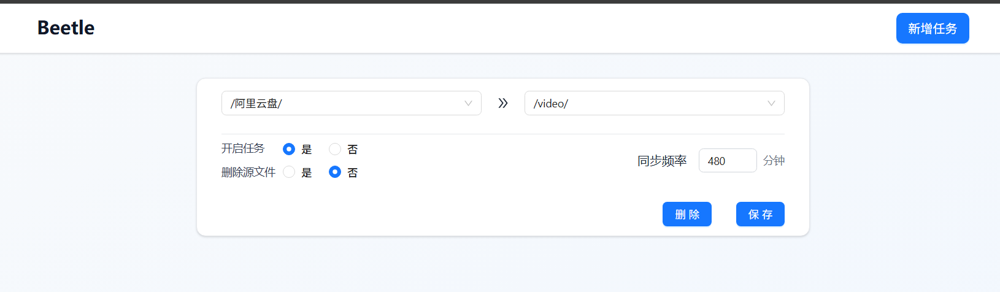

# Beetle - 文件同步工具

Beetle 是一个基于 FastAPI 和 Tortoise ORM 构建的文件同步工具，用于在不同的 OpenList 路径之间自动同步文件。



## 功能特点

- 支持自动同步文件
- 多任务并行处理
- Docker 容器化部署

## 安装

### 环境要求

- Node v22
- Python 3.13
- OpenList 服务

### 本地开发

- 克隆仓库

  ```bash
  git clone <repository-url>
  cd beetle
  ```

- 环境变量

  - 编辑 `.env` 文件，设置以下环境变量：

  ```
  PORT=8000                         # API 服务端口
  OPENLIST_HOST=<your-openlist-host> # OpenList API 主机地址
  OPENLIST_TOKEN=<your-token>        # OpenList API 访问令牌
  ```

  - 编辑 `web/.env` 文件，设置以下环境变量：

  ```
  VITE_API_URL=/api
  VITE_API_TARGET=http://localhost:8000
  ```

- 安装依赖

  ```bash
  # 后端
  pip install uv
  uv sync
  # 前端
  cd web
  npm install
  ```

- 运行

  ```bash
  # 后端
  uv run granian --access-log --host 0.0.0.0 --port ${PORT:-8000} --interface asgi beetle.main:app
  # 前端
  cd web
  npm run dev
  ```

### Docker 部署

```bash
docker compose up -d
```
- 访问 `http://localhost:${PORT:-7890}` 查看应用


## 许可证

[LICENSE](LICENSE)
